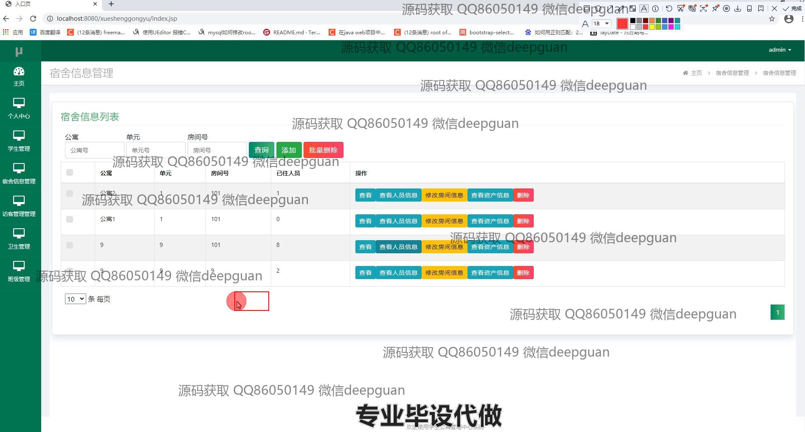
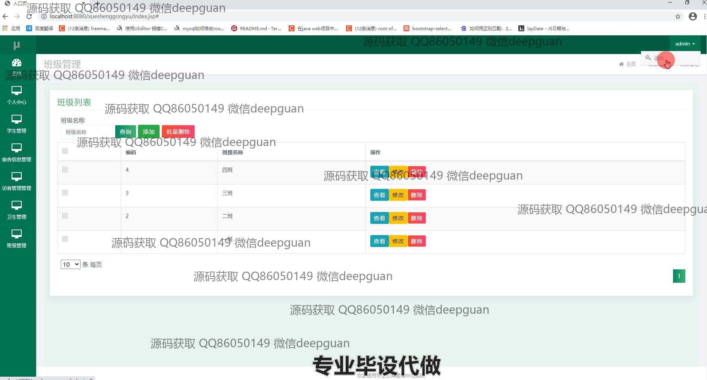

<h1 align="center">学生宿舍管理</h1>

## 简介
学生宿舍管理系统：角色分为管理员和用户；提供学生信息管理、宿舍信息管理、访客管理、卫生管理、奖惩管理、资产管理和班级管理等功能模块，实现综合宿舍管理。    --计算机毕业设计源码；毕设源码；java毕业设计源码

## 联系方式

<h3 align="center">获取完整代码与数据库文件 + 微信：deepguan QQ: 86050149 QQ群: 783742310</h3>

<h3 align="center">可帮忙远程部署 包运行成功！提供远程部署、修改代码、设计文档指导、代码讲解等服务！</h3>

## 功能介绍（完整见运行截图）
管理员：基本功能包括登录、注册和退出。主要控制和管理学生公寓系统，通过个人中心查看和修改个人信息，进行系统的配置和管理。负责管理包括学生、宿舍、资产、卫生及访客等信息的增删查改，协调班级及宿舍卫生评估。可通过宿舍信息管理快速查看公寓、单元及房间号等住宿信息，进行宿舍资源分配，资产状态管理，以及班级和访客信息的管理及查询。同时有权限在卫生管理模块中进行卫生状态跟踪、评分和记录检查时间，以确保宿舍环境的整洁。

用户（学生）：注册和登录后，可以进入个人用户中心，查看和修改自己的信息以及宿舍分配情况。通过信息管理模块查询自己的住宿信息并了解宿舍卫生状态，查看宿舍可住人数和个人寝室位置等，还可以提供对宿舍资产如家具设备的使用反馈和请求维修。能通过访客管理提交访问申请或记录宿舍访问记录，方便宿舍的安全管控。整体系统界面设计简洁，便于快速上手。

## 运行截图

本代码来源于网络,仅供学习参考使用!

